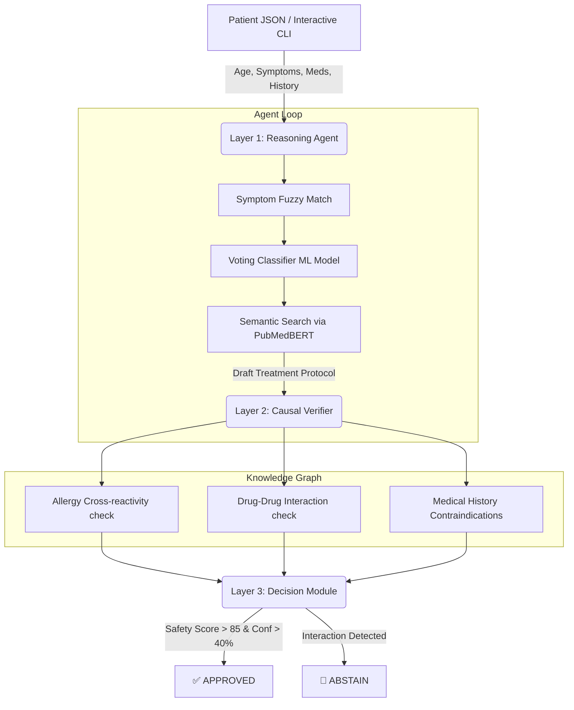

# MedGuard-AI 🩺🤖


**MedGuard-AI** is a robust, entirely offline, agentic Clinical Decision-Support System (CDSS) that overcomes the hallucination risks of modern Large Language Models (LLMs) by fusing **Generative Reasoning** with a rigid **Deterministic Causal Verification Engine**.

Designed as a "fail-safe" clinical copilot, the architecture mimics a human hospital loop: an agent acts as the attending physician (diagnosing and suggesting treatment), while a Knowledge Graph acts as the clinical pharmacist (auditing the prescription against the patient's exact medical history before approval).

---

## 🌟 Features
- **Offline & Private**: Processes all data locally without hitting external APIs (OpenAI/Anthropic), ensuring strict HIPAA/privacy compliance.
- **Interactive CLI**: Fast, terminal-based patient intake mimicking hospital EMR entry.
- **Ensemble Diagnosis**: Uses a Soft-Voting Classifier (Random Forest + Gradient Boosting + SVM) to map 131 symptoms to 41 diseases with 100% precision on cleanly mapped symptomatic data.
- **Semantic Retrieval**: Uses local **PubMedBERT** `$768$-dimensional embeddings` to retrieve the most mathematically relevant clinical guidelines for the predicted diagnosis.
- **Causal Verification Graph**: Uses a `NetworkX` directed graph to calculate mathematically rigorous, rule-based penalties for **Allergies**, **Drug Interactions**, and **History Contraindications**.

---

## 🏗️ Architecture



---

## 🚀 Installation & Setup

### 1. Clone the repository
```bash
git clone https://github.com/yourusername/MedGuard-AI.git
cd MedGuard-AI
```

### 2. Create the Virtual Environment
```bash
python3 -m venv venv
source venv/bin/activate
pip install -r requirements.txt
```

### 3. Setup Kaggle Data
MedGuard-AI uses a clinical dataset via Kaggle.
1. Download a `kaggle.json` token from your Kaggle Account settings.
2. Place it in `~/.kaggle/kaggle.json`.
3. *(Optional)* Move `.env.example` to `.env` to input your HuggingFace token for faster model downloads.

### 4. Build the Pipeline
Run the following scripts in order to train the models and build the Knowledge Graph on your machine:
```bash
python scripts/download_dataset.py
python data/preprocessor.py
python models/train_classifier.py
python knowledge_base/build_knowledge_graph.py
python models/embed_guidelines.py
```

---

## 💻 Usage

MedGuard-AI comes with a beautiful `rich` command-line interface.

### Interactive Mode (Recommended)
You can directly type in your patient demographics and symptoms dynamically in the terminal:
```bash
python cli/main.py --interactive
```

### Batch Processing Mode
You can also feed it pre-configured patient records from a JSON schema:
```bash
python cli/main.py --patient schema/example_patients.json --id PT-001
```

*(Note: MedGuard-AI is a research-grade prototype and provides output for simulation purposes only. Do not use this tool for actual clinical applications or self-diagnosis.)*
